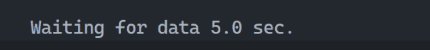

# sleep-dots 💤

> A light utility (524 bytes gzipped) for pausing the program execution for a specified amount of time and displaying a message with moving dots.

## Installation 💻

You can install the `sleep-dots` package using `npm`:

```sh
npm install sleep-dots
```

## Configuration 🔧

The `sleepWithLog` function displays the custom message along with the formatted remaining time in a loop until the specified time has elapsed.

It takes an object with three optional parameters:

- `customMessage`: The custom message to display. The default value is `'Waiting for'`.
- `finalBreakLine`: Add a break line (`\n`) at the end of the output. The default value is `true`.
- `stepTime`: The time to wait between dots updates in milliseconds. The default value is `500` (0.5 seconds).
- `totalTime`: The total time to sleep in milliseconds. The default value is `3000` (3 seconds).

## Example Usage 🚀

```javascript
import sleepWithLog from 'sleep-dots'
// or
const sleepWithLog = require('sleep-dots')

async function main() {
  console.log('Start sleeping...')
  await sleepWithLog({ totalTime: 5000, customMessage: 'Waiting for data', stepTime: 1000, finalBreakLine: false })
  console.log('Wake up!')
}

main()
```

The above example will output the following to the console:


